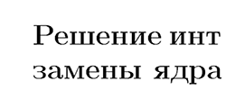

# Кастомные команды и полезное для TeX

### Таблица стандартных размеров шрифтов

| Command       | 10pt  | 11pt  | 12pt  |
| :------------ | :---- | :---- | :---- |
| \tiny         | 5     | 6     | 6     |
| \scriptsize   | 7     | 8     | 8     |
| \footnotesize | 8     | 9     | 10    |
| \small        | 9     | 10    | 10.95 |
| \normallsize  | 10    | 10.95 | 12    |
| \large        | 12    | 12    | 14.4  |
| \Large        | 14.4  | 14.4  | 17.28 |
| \LARGE        | 17.28 | 17.28 | 20.74 |
| \huge         | 20.74 | 20.74 | 24.88 |
| \Huge         | 24.88 | 24.88 | 24.88 |

### Главы без нумерации

```tex
\anonsection

\newcommand{\anonsection}[1]{\section*{#1}\addcontentsline{toc}{section}{#1}}
```


